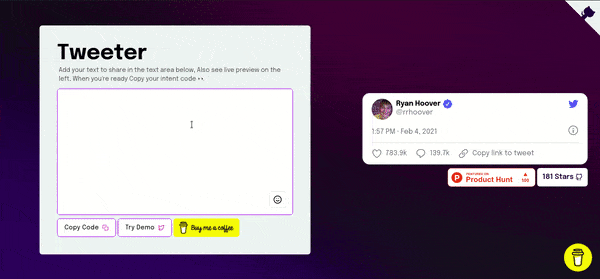
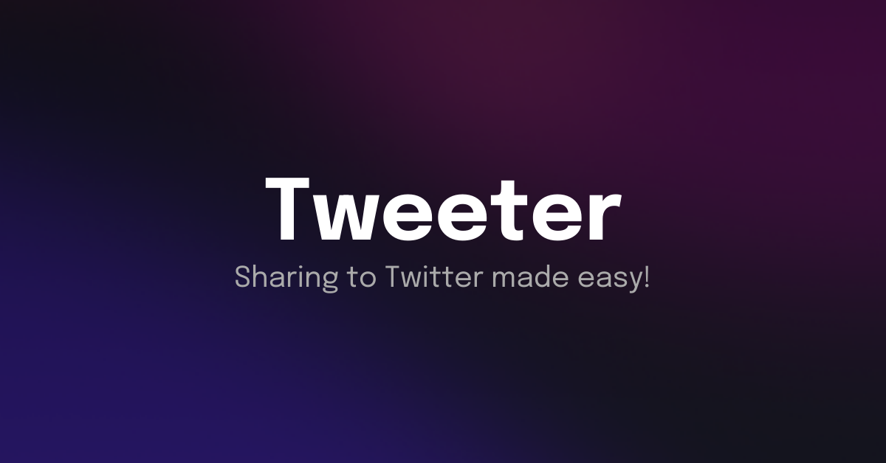

<p align="center">
  <a href="https://tweeterapp.now.sh/">
    
  </a>
</p>
<h3 align="center">Tweeter</h1>
<h4 align="center">Sharing to Twitter made easy 👀</h4>

<p align="center">
<a href="https://github.com/saviomartin/tweeter/blob/master/LICENSE" target="blank">

</a>
<a href="https://github.com/saviomartin/tweeter/fork" target="blank">

</a>
<a href="https://github.com/saviomartin/tweeter/stargazers" target="blank">

</a>
<a href="https://github.com/saviomartin/tweeter/issues" target="blank">

</a>
<a href="https://github.com/saviomartin/tweeter/pulls" target="blank">

</a>

</p>

<p align="center"></p>

<p align="center">
    <a href="https://tweeterapp.now.sh/" target="blank">View Demo</a>
    ·
    <a href="https://github.com/saviomartin/tweeter/issues/new/choose">Report Bug</a>
    ·
    <a href="https://github.com/saviomartin/tweeter/issues/new/choose">Request Feature</a>
</p>

### What's Tweeter?

Tweeter is a simple app that create high quality dynamic twitter intents for you to share on your site. Comes with live preview, hashtags, twitter emoji support, username and much more.

[Read blog to understand better 📖](https://savio.xyz/introducing-gradient-king-never-again-run-out-of-gradients)

## 🚀 Demo

<a href="https://tweeterapp.now.sh/" target="blank">

</a>

Try the tool: [Tweeter](https://tweeterapp.now.sh/)

## 🧐 Features

Provides you a huge collection of awesome, elegant gradients. You can use it absolutely for free without attribution.

> Also provides a gradient generator which would help you generate gradients from your local image.

- **Distraction Free**
- **Live Demo**
- **Live Preview on Left**
- **Twitter Emoji Support**
- **High Quality Code Generator**
- **hashtags username highlighter**
- **Twitter like feel**
- **Fully Responsive**

[Tweeter](https://tweeterapp.now.sh/) is worth bookmarking✨️

## 🛠️ Installation Steps

1. Clone the repository

```bash
git clone https://github.com/saviomartin/tweeter.git
```

2. Change the working directory

```bash
cd tweeter
```

3. Install dependencies

```bash
npm install
```

4. Run the app

```bash
npm run dev
```

🌟 You are all set!

## 🍰 Contributing

Please contribute using [GitHub Flow](https://guides.github.com/introduction/flow). Create a branch, add commits, and [open a pull request](https://github.com/saviomartin/tweeter/compare).

Please read [`CONTRIBUTING`](CONTRIBUTING.md) for details on our [`CODE OF CONDUCT`](CODE_OF_CONDUCT.md), and the process for submitting pull requests to us.

## 💻 Built with

- [Next](https://nextjs.org/)
- [Material UI](http://material-ui.com/): for styling and Icons
- [Animate.css](https://animate.style/): for smooth Animations
- [Emoji Mart](https://www.npmjs.com/package/emoji-mart): for emojis
- [react-hot-toast](https://react-hot-toast.com/): for toast
- [react-icons](https://react-icons.github.io/react-icons/): for icons

## 🛡️ License

This project is licensed under the MIT License - see the [`LICENSE`](LICENSE) file for details.

## 🦄 Deploy

[](https://cloud.digitalocean.com/apps/new?repo=https://github.com/saviomartin/tweeter)

## 🙏 Support

If you're enjoying my app, consider supporting me with a coffee ☕️

<a href="https://buymeacoffee.com/saviomartin" title="Buy Me A Coffee" >

</a>

<hr>
<p align="center">
This project needs a 🌟 from you
</p>
